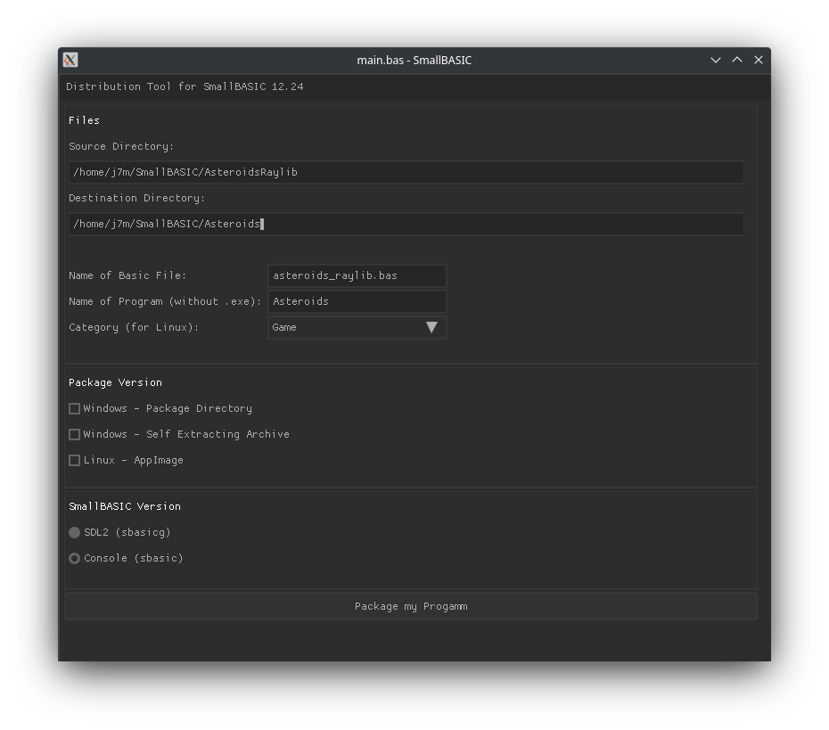
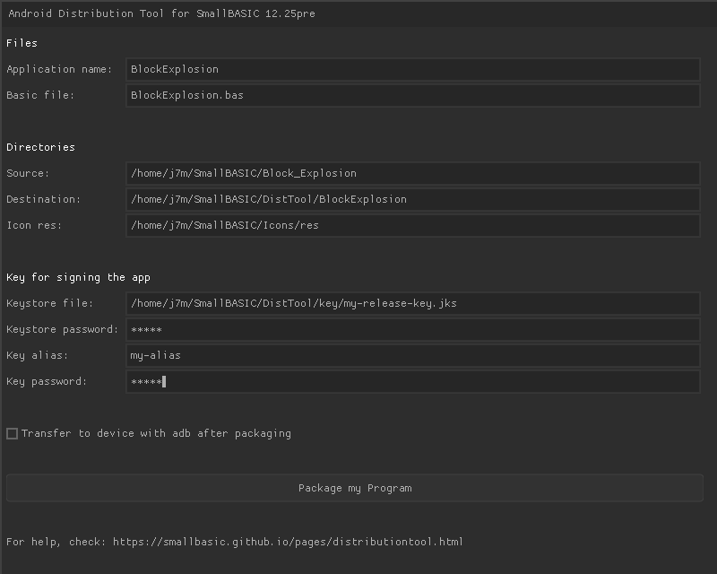

# Distribution Tool for SmallBASIC

Package your SmallBASIC program with all the file needed and distribute the package to your friends.
The packages for Windows contain an exe-file for starting your program. The Linux AppImage can be directly executed.

The following packages can be created:
- Distribution Tool for Windows:
  - Package as a directory for Win64
  - Self extracting zip file for Win64
- Distribution Tool for Linux
  - Package as a directory for Win64
  - Self extracting zip file for Win64
  - AppImage for Linux
- Distribution Tool for Android
  - Signed Android apk 
  

  
Detailed information on the [SmallBASIC website](https://smallbasic.github.io/pages/distributiontool.html).
